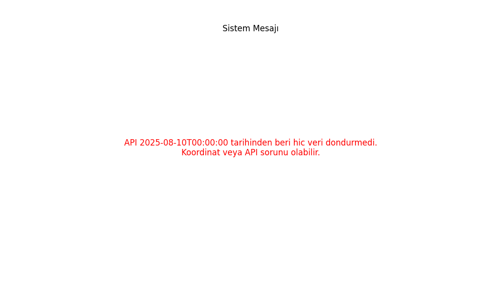

# Automated Seismic b-Value Analysis System

[](LICENSE)
[](https://doi.org/10.5281/zenodo.18331006)

This repository hosts a fully automated system for monitoring the temporal evolution of the **Gutenberg-Richter $b$-value** and **Magnitude of Completeness ($M_c$)**. The system fetches real-time seismic data from AFAD (Disaster and Emergency Management Authority of Turkey), performs statistical analysis, and publishes updated graphs every 30 minutes.

## 📊 Live Analysis
**[Click here to view the Live b-Value Graph](https://DrCanEytemiz.github.io/bvalueanalyzer/)**



## 🚀 Key Features
*   **Automated Data Fetching:** Retreives seismic data directly from AFAD's backend API.
*   **Region of Interest:** Specific coordinate box covering the Manisa/Balıkesir region (Lat: 38.9-39.4, Lon: 27.7-28.5).
*   **Timeframe:** Continuously accumulates data starting from **August 10, 2025**.
*   **Scientific Methodology:**
    *   **$M_c$ Calculation:** Maximum Curvature Method (Auto-Mc).
    *   **$b$-value Estimation:** Aki (1965) Maximum Likelihood Estimation.
    *   **Standard Error:** Shi & Bolt (1982).
*   **Automation:** Powered by GitHub Actions (Runs every 30 minutes).

## ⚠️ Citation & Licensing (Important)

This software and its outputs are licensed under the **MIT License**.
If you use this code, the methodology, or the generated graphs in your academic research or professional reports, **you must cite the original author**.

**Preferred Citation Format (APA):**

> Eytemiz, C. (2026). *Automated Seismic b-Value Analysis System* (Version 1.0.0) [Computer software]. Zenodo. https://doi.org/10.5281/zenodo.XXXXXX

**BibTeX:**

```bibtex
@software{Eytemiz_bValue_2026,
  author = {Eytemiz, Can},
  title = {Automated Seismic b-Value Analysis System},
  year = {2026},
  version = {1.0.0},
  publisher = {Zenodo},
  doi = {10.5281/zenodo.18331007},
  url = {https://github.com/DrCanEytemiz/bvalueanalyzer}
}
